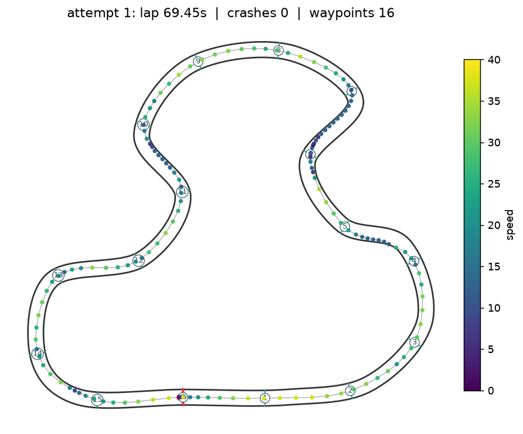

# The Agentic Grand Prix

[](https://github.com/GenomZ/race-mini-comp/actions/workflows/tests.yml)

Welcome to the Agentic Grand Prix! Your task is to design an AI agent using **LangChain** and
**LangGraph** capable of driving a virtual car around a track as fast as possible.

You are *not* writing a traditional control algorithm (PID) or training a reinforcement learning
model. You are building an **agentic workflow**: your agent perceives the environment through
textual sensor data, "thinks" about its next move, and uses specific tools to control the car.

**The challenge.** You compete against a baseline agent named **Hermes**. Hermes is a zero-shot LLM
agent given a generic prompt to drive the car. Because it thinks frame-by-frame without a plan,
memory or reflection, it is slow and error-prone. Your goal is to design a superior cognitive
architecture, using techniques like planning, memory, reflection or specialised sub-agents, and
post a faster lap time than Hermes.



---

## The environment

The track is a 2D simulation: a closed circuit ~1550 units long and 18 units wide with a long
start/finish straight, sweeping bends, esses and one hairpin. 16 invisible **waypoint gates** span the
track; gate 0 is the start/finish line.

| Rule | Value |
|------|-------|
| Tick | each `drive` call advances the simulation by **0.5 virtual seconds**. You must anticipate where the car will be. |
| Crash | hitting a wall stops the car (speed 0), nudges it 2 units back from the wall and adds a **5 s penalty**. |
| Waypoints | you must cross the 16 gates **in order**; crossing gate 0 after the other 15 completes the lap. |
| Attempt limit | an attempt ends after **500 ticks** (250 s) without a lap = DNF. |
| Lap time | simulated time + penalties. **Lower is better.** |
| Determinism | the simulation has no randomness; the same inputs always give the same lap. |

### Car physics (worth knowing)

* Top speed 40, full-throttle acceleration 12 units/s², full braking 25 units/s², light drag.
* **Steering commands a fraction of the available grip.** Yaw rate = `steering × min(1.5, 20 / speed)`
  rad/s. The turn radius at speed `v` with steering `s` is therefore `R = v² / (20·|s|)`, so a
  corner of radius `R` can be taken at no more than `√(20·R)` units/s. Fast in, fast out does not work here.
* At the 0.5 s tick, a car at speed 30 moves 15 units between decisions on an 18-unit-wide track.
  Speed management *is* the game.
* Reverse is possible (slowly) when stopped, which is how a crashed car backs off a wall.

## How to interact with the gym

Your agent receives four LangChain `StructuredTool`s (built by `agentic_gp.make_tools(env)`).
Every tool returns a **JSON string**.

### 1. `read_sensors` (ReadSensorsTool)
Returns the current state without advancing time. Input: none.

```json
{
  "speed": 24.5,
  "distance_to_wall_front": 120.0,
  "distance_to_wall_left_20": 31.0,  "distance_to_wall_right_20": 27.3,
  "distance_to_wall_left_45": 12.6,  "distance_to_wall_right_45": 12.8,
  "distance_to_wall_left_90": 8.5,   "distance_to_wall_right_90": 9.5,
  "distance_to_next_waypoint": 50.0,
  "angle_to_next_waypoint": -15.0,
  "distance_to_waypoint_after_next": 148.2,
  "angle_to_waypoint_after_next": -31.5,
  "next_waypoint_index": 3, "waypoints_passed": 2, "waypoints_total": 16,
  "position": [301.2, 4.7], "heading_deg": 12.3,
  "sim_time": 6.5, "penalty_time": 0.0, "crashes": 0,
  "tick": 13, "ticks_remaining": 487,
  "lap_complete": false, "attempt_over": false
}
```

Ray distances are LiDAR-like: distance to the nearest wall along the given bearing (max 200).
**Angles are in degrees; negative = to your LEFT, positive = to your RIGHT.**

### 2. `drive` (DriveTool)
Applies controls, advances 0.5 s and returns the same JSON plus an `events` list
(`"crash: ..."`, `"waypoint_passed: 3"`, `"lap_complete: 69.45s ..."`, `"attempt_over: ..."`).

* `throttle` (float): -1.0 (full brake / slow reverse when stopped) to 1.0 (full acceleration).
* `steering` (float): -1.0 (full left) to 1.0 (full right).

Out-of-range values are clipped.

### 3. `reset_environment` (ResetTool)
Puts the car back on the start line and starts a new attempt. The previous attempt is recorded as
is. Use it only when starting a new attempt.

### 4. `get_track_map` (TrackMapTool)
Static description of the circuit for planning: the 16 waypoint centers, the track heading at each
one, the tightest corner radius between consecutive waypoints, track width, lap length and the
physics constants above.

## Getting started

```bash
git clone https://github.com/GenomZ/race-mini-comp.git
cd race-mini-comp
python -m venv .venv && . .venv/bin/activate      # Windows: .venv\Scripts\activate
pip install -r requirements.txt
```

```bash
python run_dummy.py                 # drives straight, crashes; shows the tool loop
python run_agentic.py               # reference agentic workflow (planning, memory, reflection)
```

```bash
python evaluate.py my_agent --plot  # runs YOUR agent, saves results/my_agent.{json,png}
```

Then open [my_agent.py](my_agent.py). It is a small LangGraph with a `planner` node and an
`executor` node. Out of the box it finishes a clean but very slow lap (~207 s). Replace the
planner with an LLM, add memory and reflection, and make it fast.

### Running the Hermes baseline yourself

Hermes uses [Hermes 3](https://ollama.com/library/hermes3) through Ollama by default:

```bash
ollama pull hermes3
```

```bash
python run_hermes.py --attempts 1
```

Any LangChain chat model works. Copy `.env.example` to `.env` (or export the variables) and set
`RACE_LLM_PROVIDER` to `ollama`, `anthropic` or `openai` plus `RACE_LLM_MODEL`. Your own agent can
use the same factory, `agentic_gp.llm.get_chat_model()`, so switching models is one environment
variable, e.g. a strong planner on `claude-opus-5` and a fast executor on `claude-haiku-4-5`.

## Strategy hints for agentic design

Driving needs fast reactions, which LLMs struggle with if asked to reason about every tick. To beat
Hermes, separate planning from execution:

1. **Planner agent.** Call `get_track_map` once, reason about the layout (corner radii → safe speeds
   via `√(20·R)`), and set a target speed and line for the next segment.
2. **Execution agent.** Use a small, fast model, or plain code driven by the planner's instructions,
   to issue `drive` calls quickly that match the target state. Look at the sensor fields the
   planner gave you and nothing else.
3. **Reflection.** After a crash or a finished attempt, feed the event log (`events`, `env.attempts`)
   back to a reflection step that rewrites the plan, then `reset_environment` and go again.
4. **Memory.** Remember per-segment speeds that worked. The simulation is deterministic, so what
   worked last attempt works again.

## Rules for submissions

* Submit `my_agent.py` (plus any modules it imports). Keep the `run(env, tools, attempts=1, **kwargs)`
  entry point.
* Move the car **only through the tools**. Reading `env.attempts` / the JSONL log for reflection is
  fine; touching `env.car`, `env.track` internals or physics is not.
* Evaluation: `python evaluate.py path/to/my_agent.py --name <team> --attempts 3 --plot`. Your
  **best completed lap** counts. Ties break on fewer crashes.
* Wall-clock budget per evaluation: 30 minutes. Bring your own API keys.

## Repository layout

```
agentic_gp/            the gym package
  config.py            physics + competition constants (PhysicsConfig)
  geometry.py          rays, segment intersection, splines
  track.py             Track: centerline, walls, waypoint gates, get_track_map data
  physics.py           car model
  env.py               RaceEnv: reset / step / sensors, lap logic, JSONL logging
  tools.py             LangChain StructuredTool bindings (make_tools)
  llm.py               get_chat_model(): ollama | anthropic | openai
  render.py            matplotlib plots of tracks and attempts
  leaderboard.py       results/*.json -> LEADERBOARD.md
  agents/dummy.py      drives straight
  agents/hermes.py     the zero-shot LLM baseline
  agents/reflex.py     rule-based organiser reference (clean lap ~69 s)
  agents/agentic.py    reference agentic workflow (planning, memory, reflection ~91 s)
my_agent.py            YOUR LangGraph agent (starter provided)
evaluate.py            run an agent, record results, plot
run_dummy.py / run_hermes.py / run_agentic.py
results/               JSON + PNG per evaluated agent; LEADERBOARD.md is generated from these
docs/                  implementation plan, architecture notes, organiser guide
tests/                 pytest suite (python -m pytest)
```

Reference times on the default track: the dummy DNFs; the starter `my_agent.py` laps in ~207 s; the
reference agentic workflow `agentic` laps clean in ~91 s; the rule-based reference driver laps clean in ~69 s.
Hermes' time depends on the model you run it with - measure it with `run_hermes.py` and beat it.
